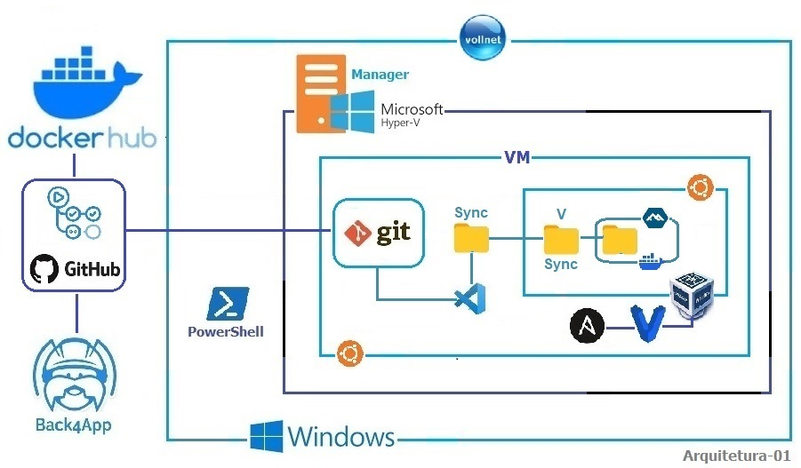

# VM-VOLL 

## General Information

    - DEVOPS Location    :
    - Project Name       :
    - Plataform Type     :
    - Production Provider:
    - Construction Date  : MM/DD/YYYY
    - Release Date       : MM/DD/YYYY

## HOST (VM && Bare Metal) 

    Each VM-VOLL-XX is dedicated to ONLY ONE project. Then, the GitHub account will have a copy of the environment provisioning as well as the project code.

## VM VBox 

### Requirements 

    * Plataforms:

        - [01] Javascript/TypeScript/NodeJS: NextJS/NestJS

            [01A] Javascript/TypeScript

            [01B] NodeJS

            [01C] NextJS/NestJS

        - [02] Python && Django/Flask

            [02A] Python

            [02B] Django/Flask

        - [03] Golang

            [03A] Golang

        - [04] Flutter/Dart

            [04A] Dart 

            [04B] Flutter
       

## Host Installation 

    - SO Windows/Linux 
    - Hypervisors: Hyper-V, Virtualbox, VMware/ESXi
    - Chrome
    - VSCode
    - Virtualbox 7.0
    - Vagrant 2.4.1 or later && Plugin VBGuest
    - Ansible (via PPA)
    - Git/GitHub/GitHub Actions
    - Provider Back4App  

## Operational 

## Location

    Device ......:

    SO ..........:

    Hypervisor ..:

    VM-Host .....:

## Maintenance

## Troubleshooting

## FAQ

## Learnings
